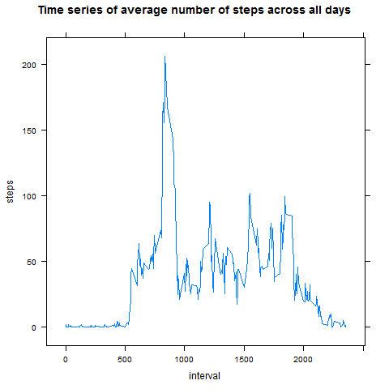
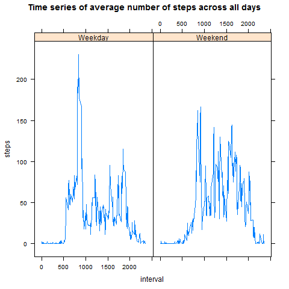

# Reproducible Research: Peer Assessment 1
___

## Loading and preprocessing the data
Columns types are specified when loading the data, this is faster in comparison to
transforming the data later on. This is all the data transformation we'll need.

```r
library(lattice)
library(stats)

df <- read.csv('activity.csv', header = T, 
               colClasses = c(steps = 'numeric', date = 'Date', interval = 'numeric'),
               na.strings = 'NA')
```


## What is mean total number of steps taken per day?
Ignoring missing values as specified.

```r
#Calculate the sum of steps taken each day, ignoring NA's
steps_by_date <- by(df, df$date, function(x) sum(x$steps, na.rm = T))

png('figure/figure1.png')
hist(steps_by_date, main = 'Histogram of the total number of steps taken each day', col = 'blue', xlab = 'steps')
dev.off()
```

```
## png 
##   2
```

```r
mean_steps <- mean(steps_by_date)
median_steps <- median(steps_by_date)
```

 

* **Mean of steps taken per day:** 9354
* **Median of steps taken per day:** 10395


## What is the average daily activity pattern?

```r
steps_averaged_by_interval = aggregate(steps ~ interval, data = df, FUN = mean)

png('figure/figure2.png')
xyplot(steps ~ interval, 
       data = steps_averaged_by_interval,
       type = 'l',
       main = "Time series of average number of steps across all days")
dev.off()
```

```
## png 
##   2
```

```r
interval_index = which.max(steps_averaged_by_interval$steps)
```



**The 5-minute interval with the maximum average number of steps has identifier:** 835

## Imputing missing values
Using mean for each interval to fill missing values of steps.

```r
total_nas <- with(df, sum(is.na(steps) | is.na(date) | is.na(interval)))

#This auxiliar function receives a portion of the dataframe with the same value in the field interval and determines 
#if the steps variable is missing, if it is, it is filled with the mean value of steps for that particular interval
fill_na <- function(x) {
    interval_value <- x$interval[1]
    x[is.na(x$steps), 'steps'] <- steps_averaged_by_interval[steps_averaged_by_interval$interval == interval_value, 'steps']
    x
}

#Separate dataframe in small dataframes with the same interval value, apply fill_na, and rebuild the dataframe
df2 <- do.call("rbind", by(data = df, df$interval, fill_na))
df2 <- df2[order(df2$date, df2$interval), ]  #Sort like the original dataframe
rownames(df2) <- NULL  #Reset indexes

steps_by_date2 <- by(df2, df2$date, function(x) sum(x$steps))

png('figure/figure3.png')
hist(steps_by_date2, main = 'Histogram of the total number of steps taken each day (NAs filled)', col = 'blue', xlab = 'steps')
dev.off()
```

```
## png 
##   2
```

```r
mean_steps2 <- mean(steps_by_date2)
median_steps2 <- median(steps_by_date2)
```

**Total number of rows with NA's is:** 2304 


After filling NA's values:  

* **Mean of steps taken per day:** 10766  
* **Median of steps taken per day:** 10766  

The values changed because of filling the missing values. The chosen strategy had an impact in these statistics: the steps variable is more symmetric and thus the median and the mean have similar values.

## Are there differences in activity patterns between weekdays and weekends?
Factor variable in the form of a new column: *daytype*.

```r
df2$daytype <- ifelse(weekdays(df$date) == 'Sunday' | weekdays(df$date) == 'Saturday', 'Weekend', 'Weekday')

#This time we consider interval and daytype
steps_averaged_by_interval2 = aggregate(steps ~ interval * daytype, data = df2, FUN = mean)

png('figure/figure4.png')
xyplot(steps ~ interval | daytype, 
       data = steps_averaged_by_interval2,
       type = 'l',
       main = "Time series of average number of steps across all days")
dev.off()
```

```
## png 
##   2
```


